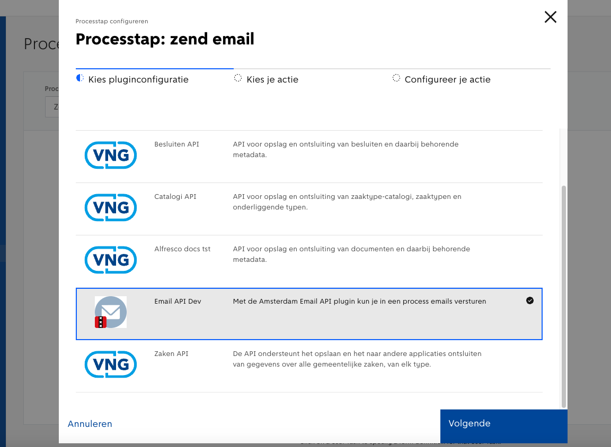

# Amsterdam Email API plugin

Zend emails met de Email API (beschikbaar bij Gemeente Amsterdam)
## Configuratie

### Configureer plugin
Om de plugin te configureren:

1. Selecteer de plugin via menu item plugins.\
   
2. Voeg email API URL, clientId, clientSecret en token endpoint toe\
   

### Link plugin actie met process stap
Om een process stap te linken met de zend email actie

1. Selecteer process onder menu item "Form links plugin"\
   
2. Klik op de gewenste process stap en selecteer de Email API\
   
3. Selecteer de zend-email actie van de Email API\
   
4. Configureer de zend-email actie van de Email API\
   

